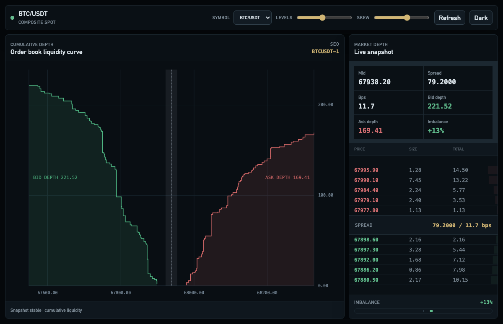
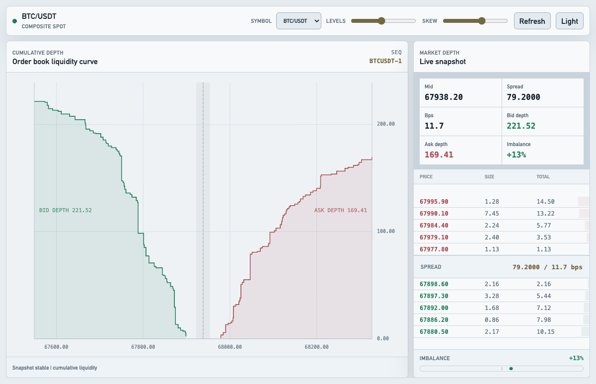
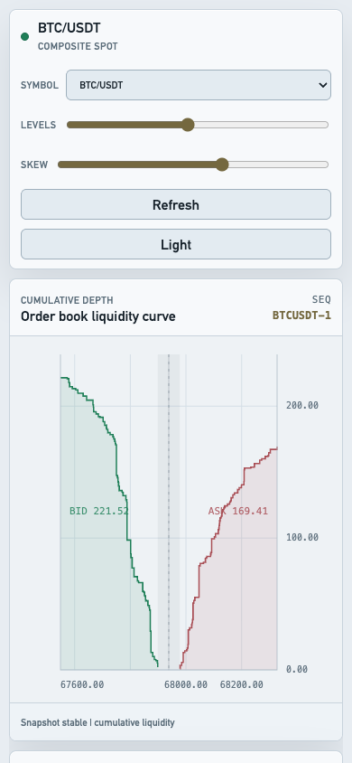

# @rekurt/depth

Professional, framework-agnostic depth chart for web trading interfaces.

<p align="center">
  <a href="https://github.com/rekurt/depth/releases"></a>
  <a href="https://github.com/rekurt/depth/blob/master/LICENSE"></a>
  
  
</p>

<p align="center">
  <strong>Institutional-grade order-book depth visualization without a heavy charting runtime.</strong>
</p>

<p align="center">
  
</p>

<table>
  <tr>
    <td width="68%">
      
    </td>
    <td width="32%">
      
    </td>
  </tr>
</table>

`@rekurt/depth` renders cumulative order-book liquidity on a canvas with a
small TypeScript API, deterministic book math, and no charting runtime
dependency. It is built for product teams that need a serious market-depth
primitive they can wrap in React, Vue, Svelte, or plain DOM code without pulling
in a full exchange UI.

## Why

Most depth-chart widgets are either demo-level SVG toys or large charting
packages with order-book math bolted on. This package keeps the core narrow:
normalize the book, compute the view and metrics, render a restrained canvas
chart, and expose the state you need for a professional trading UI.

## Highlights

- Framework-agnostic `DepthChart` class with a stable imperative API.
- Canvas renderer with separate interaction layer for hover/crosshair state.
- Typed-array render view for predictable memory layout and fast redraws.
- Deterministic aggregation for duplicate prices and zero-volume deletion.
- Correct cumulative depth direction for bids and asks.
- Centered price domain by default so the midpoint stays visually centered.
- Optional fit-domain mode for full-range inspection.
- Dark and light themes tuned for institutional fintech surfaces.
- ESM and CommonJS builds with TypeScript declarations.

## Visual Direction

The demo is intentionally styled as a dense institutional trading surface:
graphite/ink dark mode, cold premium light mode, muted liquidity fills, neutral
spread treatment, and bid/ask color used only as signal. The renderer avoids
decorative gradients and exchange-clone glow so the chart can sit inside a
serious SaaS or brokerage product without visual noise.

## Install

```bash
npm install @rekurt/depth
```

## Quick Start

```ts
import { DepthChart } from '@rekurt/depth';

const chart = new DepthChart({
  container: document.getElementById('depth')!,
  theme: 'auto',
  maxLevels: 80,
  priceDomainMode: 'centered',
  shape: 'step',
  showSpread: true,
  showMidLine: true,
  showLabels: true,
  data: {
    bids: [
      { price: 99, volume: 2 },
      { price: 98, volume: 4 },
    ],
    asks: [
      { price: 101, volume: 3 },
      { price: 102, volume: 5 },
    ],
  },
  onHover(level) {
    console.log(level);
  },
});

chart.setData(nextOrderBookSnapshot);
chart.updateOptions({ maxLevels: 120, shape: 'linear' });

const metrics = chart.getMetrics();
console.log(metrics.spread, metrics.spreadBps, metrics.imbalance);

chart.fitAll();
chart.destroy();
```

The package does not ship a framework wrapper. In React/Vue/Svelte, mount the
chart once, feed snapshots through `setData`, and call `destroy` on unmount.

## Data Contract

```ts
interface DepthSnapshot {
  bids: DepthLevel[];
  asks: DepthLevel[];
  midPrice?: number;
  timestamp?: number;
  sequence?: number | string;
}

interface DepthLevel {
  price: number;
  volume: number;
}
```

Validation rules:

- `price` must be a finite positive number.
- `volume` must be a finite non-negative number.
- Duplicate prices are merged by summing volume.
- Merged zero-volume levels are removed from the render view.

Book view rules:

- Bids are selected as the best `N` levels by descending price, then returned in
  ascending price order for left-to-right rendering.
- Asks are selected as the best `N` levels by ascending price and returned in
  ascending price order.
- Bid cumulative depth is computed from best bid outward.
- Ask cumulative depth is computed from best ask outward.
- `maxLevels` is applied before cumulative values are computed.

Metrics:

```ts
spread = bestAsk - bestBid
midPrice = explicitMidPrice ?? (bestBid + bestAsk) / 2
spreadBps = spread / midPrice * 10000
imbalance = (bidTotal - askTotal) / (bidTotal + askTotal)
```

For an empty book, imbalance is `0`. For one-sided books without an explicit
midpoint, `midPrice`, `spread`, and `spreadBps` are `null`.

## Price Domain

The default domain mode is `centered`.

```ts
new DepthChart({
  container,
  data,
  priceDomainMode: 'centered',
});
```

When both sides are present, the chart expands symmetrically around `midPrice`.
That keeps the spread/midline visually centered even when one side has a wider
price range.

Use `fit` when you want the smallest domain that contains all visible levels:

```ts
chart.updateOptions({ priceDomainMode: 'fit' });
```

## API

```ts
const chart = new DepthChart(options);
```

Methods:

- `setData(snapshot)` validates and renders a new order-book snapshot.
- `updateOptions(options)` changes render/data options without rebuilding DOM.
- `setTheme(theme)` accepts `'dark'`, `'light'`, `'auto'`, or explicit colors.
- `fitAll()` resets the viewport domain to the current snapshot.
- `resize(width, height)` manually resizes the canvas layers.
- `destroy()` removes DOM/event resources and is idempotent.
- `getSnapshot()` returns a defensive copy of the latest raw snapshot.
- `getView()` returns the typed-array render view.
- `getMetrics()` returns best bid/ask, spread, bps, totals, and imbalance.

Useful options:

- `maxLevels`: keep only the best `N` merged levels per side.
- `priceDomainMode`: `'centered'` or `'fit'`.
- `shape`: `'step'` or `'linear'`.
- `showGrid`, `showSpread`, `showMidLine`, `showLabels`: chart chrome toggles.
- `emptyMessage`: no-data state text.
- `priceFormat`, `volumeFormat`: format axes, labels, and tooltip values.
- `onHover`: receives the nearest visible level or `null`.
- `onError`: receives validation/render/interaction errors.

## Theming

Use a built-in theme:

```ts
chart.setTheme('dark');
chart.setTheme('light');
chart.setTheme('auto');
```

Or pass explicit colors:

```ts
chart.setTheme({
  background: '#090e13',
  grid: '#17232c',
  axis: '#2a3945',
  text: '#d8e2ea',
  mutedText: '#748594',
  bidLine: '#4fb783',
  bidFill: 'rgba(79, 183, 131, 0.12)',
  askLine: '#d96a6a',
  askFill: 'rgba(217, 106, 106, 0.12)',
  midLine: '#9aa7b2',
  crosshair: '#aeb8c2',
});
```

The renderer intentionally uses restrained solid translucent fills instead of
heavy gradients. Spread is rendered as a neutral band, not as a red/green
decorative separator.

## Example

The repository includes a vanilla Vite demo with synthetic BTC/ETH/SOL books,
desktop/mobile layouts, a centered order-book ladder, hover inspection, and
dark/light themes.

```bash
npm run dev:example
```

## Build And Verify

```bash
npm install
npm test
npm run typecheck
npm run lint
npm run build
npm run build:example
npm pack --dry-run
```

`npm pack --dry-run` verifies that the published tarball contains `README.md`,
ESM/CJS builds, sourcemaps, and TypeScript declarations.

## Package Surface

The public package intentionally stays small:

- `DepthChart`
- `DepthBuffer`
- `DepthViewport`
- `DepthRenderer`
- TypeScript types for snapshots, levels, metrics, themes, and options.

The core API is DOM/canvas-based and framework-independent.

## License

MIT
